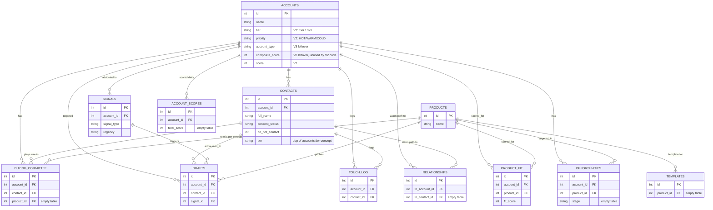

# DRIP — Phase 1: System Discovery Report

**Decimal Relationship Intelligence Platform**
Prepared per Master PRD v1.0, Section 21 (Execution Strategy, Phase 1)
Scope inspected: `C:\Users\Puneet\Desktop\ABM business logic\` (folder connected for this session)
Status: **STOP — awaiting approval before Phase 2**

---

## 0. Summary

The PRD's Section 3 ("Current Environment") assumes a running PostgreSQL instance with existing APIs, an existing dashboard, and existing ETL feeding it. That assumption does not match what's on disk. What actually exists is **three separate, non-integrated efforts at three different maturity levels**, plus this new PRD as a fourth, broader vision:

| # | Artifact | Maturity | Stack | Status |
|---|---|---|---|---|
| 1 | **decimal_abm** (`/decimal_abm/`) | Running code, thin data | Flask + **SQLite** | Live today at `localhost:5000`. 25 accounts, mostly empty everywhere else. |
| 2 | **ABM Business Logic Bible** (`/all sections/`, `/final rules/`, `/build artifcat/`) | Fully specified, **not built** | FastAPI + PostgreSQL + n8n + HubSpot (spec only) | 1,065 rules, 33 entities, 12-stage build order, API contracts, scoring formulas — a complete spec with zero corresponding code. |
| 3 | **brip_dashboard** (`/brip_dashboard/`) | Partial prototype, **no schema** | Flask + **PostgreSQL** (`brip` db) | Queries 11 tables (`organizations`, `persons`, `org_org_relationships`, etc.) that have **no `CREATE TABLE` script anywhere in the folder**. Whether this database currently exists on your machine is unverified from this session. |
| 4 | **DRIP PRD** (this document) | Vision, not yet reconciled with 1–3 | FastAPI + PostgreSQL + Alembic + SOLID/Repository pattern | Broadest scope: adds vendors, technology stack tracking, document/OCR intelligence, and a 12-dashboard suite not present in 1–3. |

None of these four are the same thing, and none of them fully contain the others. Phase 2 cannot be "migrate the existing DB" — there are three candidate schemas and no live Postgres to migrate *to* yet. The rest of this report inspects each one and proposes how to reconcile them.

---

## 1. What's actually running today — `decimal_abm`

**Location:** `decimal_abm/` · **Entry point:** `python engine_scheduler.py` · **Dashboard:** Flask app on `localhost:5000` (`abm_engine/dashboard/app.py`, 21 routes) · **DB:** SQLite at `decimal_abm/abm_engine.db`, confirmed via `DATABASE_URL=sqlite://...` in `.env` — **PostgreSQL is not connected**, despite the PG_HOST/PG_PORT/PG_DBNAME/PG_USER/PG_PASSWORD variables sitting unused at the bottom of the same `.env` file.

**Modules present:** `core/` (loader, models, orchestrator), `agents/` (researcher, writer, notifier), `channels/` (email, HubSpot, LinkedIn, Mailchimp, webhook server), `database/db.py`, `scheduler/runner.py`, `signals/monitor.py`, `scoring/engine.py`, `reporting/kpi.py`.

**Live database inventory** (queried directly, not from documentation):

| Table | Rows | Note |
|---|---:|---|
| `accounts` | 25 | Row 1 is `"Decimal Technologies"` itself (a test/self-referential row — data hygiene issue) |
| `contacts` | **1** | The single row is a test contact (`Puneet Kumar`, `puneetkumark24@gmail.com`) — **the 20+ real KSA contacts documented in project memory are not loaded into this table** |
| `signals` | 264 | Actively populated by the RSS scanner |
| `products` | 5 | Vahana, vHub, Open Banking Suite, Digital Account Opening, LMS |
| `audit_log` | 31 | |
| `score_breakdowns` | 4 | Legacy V8 table (see below) |
| `drafts`, `touch_log` | 1 each | |
| `draft_messages`, `touch_records`, `news_items`, `engagement_events`, `kpi_snapshots`, `research_cache`, `product_fit`, `account_scores`, `relationships`, `opportunities`, `buying_committee`, `templates`, `unsubscribes` | 0 | Empty |

**Schema drift confirmed:** the live database has **22 tables**, not the 15 defined in `schema_v2.sql`. Seven V8-era tables (`draft_messages`, `touch_records`, `news_items`, `score_breakdowns`, `engagement_events`, `kpi_snapshots`, `research_cache`) still exist alongside their V2 replacements (`drafts`, `touch_log`, `signals`, `account_scores`). The `accounts` and `contacts` tables are **merged supersets** — e.g. `accounts` carries both the V8 `composite_score`/`account_type` columns and the V2 `score`/`tier`/`priority` columns side by side, uncoordinated. `migrate_to_v2.py` migrated data but never dropped the old tables.

**Real contact data exists but isn't loaded:** `abm_engine/data/abm_contacts.xlsx` is present on disk. `seed_accounts.py` exists and was run (25 accounts loaded); **`seed_contacts.py` does not exist in the current codebase** (referenced in project memory's file structure but not found here) — which is consistent with `contacts` having 1 row instead of 20+.

---

## 2. What's fully designed but never built — the ABM Business Logic Bible

**Location:** `all sections/` (19 sections), `final rules/` (3 FSD documents + coherence audits + cover index), `build artifcat/` (3 engineering artifacts).

This is the most mature architectural asset in the folder, and it directly answers most of what Phase 1 is supposed to produce — it just predates this PRD and uses different terminology.

- **Scale:** 1,065 rules total, delivered in three additive tiers — MVP (462 rules), Production (+404 → 866), Perfect (+199 → 1,065).
- **Entity model (Section 2):** 33 entities across 5 tiers, each derived via a 5-Whys excavation with field-level specs and provenance rules:
  - **Tier 1 — Core (5):** `Account`, `Contact`, `Signal`, `Message`, `Engagement_Event`
  - **Tier 2 — Intelligence (10):** `Three_Score_Record`, `Enrichment`, `Buying_Window`, `Buying_Committee_Member`, `Initiative`, `Vendor_Intelligence`, `Organizational_Assessment`, `Relationship_Edge`, `Connector`, `Market_Interaction_History`
  - **Tier 3 — Decision (8):** `Reasoning_Chain`, `Outreach_Sequence`, `Account_Strategy`, `Portfolio_Allocation`, `Conflict_Resolution`, `Decision_Pattern`, `Risk_Assessment`, `Human_Review_Record`
  - **Tier 4 — Governance (6):** `Trust_Capital_Ledger`, `System_Event`, `Rule_Registry`, `AI_Model_Registry`, `Prompt_Version`, `Capability_Gap`
  - **Tier 5 — Analytics (4):** `Outcome_Attribution`, `Timing_Record`, `Feedback_Loop_Entry`, `Performance_Baseline`
- **Target stack (already decided, per the Cover Index):** n8n (routing only, zero business logic) · **FastAPI** (all logic) · **PostgreSQL** (engine source of truth) · HubSpot (deal source of truth) · Claude Sonnet + GPT · Instantly (email) · Heyreach (LinkedIn) · Apollo/Clearbit/Clay (enrichment) · Metabase (analytics). This is compatible with the DRIP PRD's Section 20 coding standards (FastAPI/PostgreSQL/SOLID/Repository pattern) but adds several tools DRIP doesn't mention (n8n, HubSpot as deal source of truth, Metabase).
- **Scoring spine (already defined, not generic):** `Effective Opportunity = Dynamic × (ICS/100) × Stage × Budget × Entrenchment × Risk × Window`; `Decision Score = Effective Opportunity × (Readiness/100) / Capital Cost`. A worked example (`T-SCORE-1`: 46.8) exists as the canonical test case.
- **Build sequence (Build Artifact 3):** 12 dependency-ordered stages with pass/fail acceptance tests, e.g. Stage 1 = Postgres schema for 12 core entities, Stage 3 = scoring engine (flagged as highest-risk for silent divergence between engineers), Stage 9 = Autonomy Ladder A0–A2, Stage 12 = kill switch + constitutional constraints.
- **API Contracts artifact:** 12 FastAPI endpoint contracts already specified (request/response schemas) — not yet cross-checked against DRIP's API layer requirements in this session; worth a full read before Phase 4.

**Nothing in this specification has corresponding code.** `decimal_abm` implements none of the 33 entities, none of the scoring formula, no Rule_Registry, no Trust_Capital_Ledger, no Autonomy Ladder. It is a much simpler, earlier system that predates the Bible and was never rebuilt to match it.

---

## 3. What's half-prototyped — `brip_dashboard`

**Location:** `brip_dashboard/` · `brip_app.py` (262 lines, 6 routes) connects via `psycopg2` to a PostgreSQL database named `brip` on `localhost:5432`.

The table names it queries — `organizations`, `persons`, `org_org_relationships`, `person_person_relationships`, `buying_committee_members`, `org_initiatives`, `org_intel_observations`, `signals`, `opportunities`, `products`, `org_type_tags` — are a **closer match to the DRIP PRD's vocabulary** (`Organization`, not `Account`; type tags like `commercial_bank`/`islamic_bank`/`digital_bank`; `seniority_level` enums like `c_suite`/`svp_evp`; `is_decision_maker`/`is_influencer`/`is_connector` booleans on person) than either `decimal_abm` or the Bible's `Account`-centric model.

**Critical finding:** there is **no DDL for the `brip` database anywhere in this folder** — no `.sql` file, no Alembic migration, no `CREATE TABLE` in any `.py` file. `brip_dashboard/db.py` sitting next to `brip_app.py` is a red herring: its docstring says `abm_engine/database/db.py` and it defines the **decimal_abm SQLite schema**, not the Postgres `brip` schema `brip_app.py` actually queries. It appears to be a stray copy, unused by `brip_app.py`. Whether the `brip` Postgres database exists and has data on your machine could not be verified in this session — Cowork's sandbox cannot reach `localhost:5432` on your laptop, and no connection string or export was found. **This needs to be checked directly on your machine before Phase 2 planning finalizes.**

Templates exist for `index`, `bank_detail`, `persons`, `connectors`, `initiatives` — a genuine start on the "Bank Dashboard" and "People Dashboard" the DRIP PRD asks for in Section 17.

---

## 4. Gap Analysis — DRIP PRD assumptions vs. reality

| PRD Section | PRD Assumes | Reality Found |
|---|---|---|
| §3 Current Environment | "PostgreSQL running locally," "existing database, APIs, dashboard" already built on it | Live system runs on **SQLite**. A `brip` Postgres database is referenced by code but its schema/data existence is unverified. No FastAPI layer exists anywhere — only Flask. |
| §3 | Google Drive connected | No active Google Drive connector in this session; the "document repository" inspected here is a local folder, not Drive. If Drive is meant to be the real source, it needs to be connected as an MCP source. |
| §6 Organization Master | Single organization entity covering banks, subsidiaries, parents, vendors, regulators | Three competing models: Bible's prospect-centric `Account` (KSA banking only), `brip_dashboard`'s broader `organizations` + `org_type_tags` (closer fit, but schema doesn't exist), and `decimal_abm`'s flat `accounts` table (bank-only, no parent/subsidiary FK). None currently model vendors/regulators as first-class organizations. |
| §7 People Intelligence, "1,000,000+ contacts" | Architecture already supports scale | Current `contacts` table has **1 row**. Real data (~20+ documented contacts, plus a contacts spreadsheet) exists but isn't loaded. No architecture has been load-tested at any scale. |
| §9–10 Vendor & Technology Intelligence | Dedicated modules | The Bible already has a `Vendor_Intelligence` entity (Tier 2) with a field spec — this is reusable, not a fresh design. |
| §11 Relationship Graph | Generic org↔org, org↔employee, etc. | The Bible's `Relationship_Edge` and `Connector` entities cover much of this; `brip_dashboard` has `org_org_relationships` and `person_person_relationships` tables (schema not found) that map even more directly. Reconciling these two designs is the actual Phase 2 work, not building from scratch. |
| §14 Document Intelligence (OCR, entity extraction, embeddings) | Exists conceptually | No OCR, entity-extraction, or embeddings code found anywhere in the three artifacts. This is genuinely greenfield. |
| §16 Identity Resolution | Exists conceptually | Not built. The closest precedent is `CONTACT-IDENTITY-001` in the Bible (person persists across job changes) — a good design principle to inherit, but no dedup/matching code exists. |
| §18 API Layer — FastAPI, CRUD, bulk upload, auth, audit | Assumed buildable on existing APIs | No FastAPI code exists in any of the three artifacts. The Bible's Build Artifact 2 (API Contracts) is a spec for 12 endpoints — a strong starting point, but unimplemented. |
| §19 Database — PostgreSQL, Alembic, partitioning, materialized views | "Existing database" to inspect | No Postgres database was reachable/verifiable from this session. No Alembic anywhere. `migrate_sqlite_to_pg.py` exists but targets a **different, older Postgres schema** (V8-era column names like `composite_score`, `has_warm_contact`) that doesn't match `schema_v2.sql`'s current columns — running it today would fail or silently miss data. |
| §22 "Never recreate existing work" | Implies one canonical existing system | There are three non-canonical systems at different maturity levels pulling in different directions (`Account` vs `Organization`, SQLite vs Postgres, Flask vs FastAPI). Part of Phase 2 must be an explicit reconciliation decision, not a straight migration. |

**Additional finding, not PRD-related but material to any migration:** `brip_app.py` has a hardcoded fallback database password in source (`os.environ.get("BRIP_DB_PASSWORD", "Puneet123@")`), and `migrate_sqlite_to_pg.py` has the same default password in a comment. Both should move to `.env`-only with no hardcoded fallback before this code goes anywhere near production.

---

## 5. Current-State ER Diagram (decimal_abm, live SQLite — what's actually running)

**Not shown above, but physically present and orphaned in the live database:** `draft_messages`, `touch_records`, `news_items`, `score_breakdowns`, `engagement_events`, `kpi_snapshots`, `research_cache` — V8-era tables with their own (incompatible) foreign keys into `contacts`, superseded by the tables above but never dropped.

---

## 6. Proposed Target Entity Model (reconciling Bible + brip_dashboard + DRIP PRD)

This is a **proposal for Phase 2 discussion, not a decision** — flagging it now because building the ER diagram surfaced the core design fork you'll need to resolve before any schema work starts.

**The fork:** the Bible's `Account` entity is deliberately prospect-scoped ("any organization Decimal could sell to") with a rich sales-decision state machine. The DRIP PRD's `Organization` entity is deliberately universal (banks, subsidiaries, regulators, vendors, associations — most of which Decimal will never sell to directly). `brip_dashboard`'s `organizations` + `org_type_tags` table design already sits in between: one universal table with a type-tag join table for multi-classification.

**Recommendation to evaluate in Phase 2:** adopt `brip_dashboard`'s shape — one `organizations` table (universal, matches DRIP §6) — and treat the Bible's `Account` as a **subtype view**: an organization becomes sales-relevant when it acquires the Bible's sales-decision fields (`current_state`, `lifecycle_status`, three-score record, buying window, etc.) via a 1:1 `account_intelligence` extension table. This reuses the Bible's 163 rules of hard-won sales logic without forcing every regulator or vendor row to carry sales-pipeline fields it will never use. The Bible's `Vendor_Intelligence`, `Relationship_Edge`, and `Connector` entities extend naturally onto the same universal `organizations`/`persons` base.

This reconciliation — not a fresh build — is the real first deliverable of Phase 2.

---

## 7. Migration Plan (proposed)

The Bible's existing 12-stage build order (Section 2 above) is a strong, tested sequencing — reuse it rather than re-deriving one from the DRIP PRD's generic phase list. The changes needed are additive, to fold in what DRIP adds that the Bible doesn't cover, and to fix the data/schema debt found in Section 1 above:

**Phase 2a — Reconciliation & environment truth (before any code)**
1. Confirm on your actual machine: does the `brip` Postgres database exist, and does it have data? (Unverifiable from this sandboxed session.)
2. Decide the `Account` vs `Organization` fork (Section 6) with input from Astha/Yogesh — this decision gates everything downstream.
3. Recover real contact data: load `abm_contacts.xlsx` and the ~20 documented contacts into whichever schema is chosen; retire the test row.
4. Retire the 7 orphaned V8 tables in `decimal_abm/abm_engine.db` (archive, don't silently drop — Golden Rule §22).
5. Rewrite `migrate_sqlite_to_pg.py` — it currently targets stale, pre-V2 column names and will fail or silently drop data against the current `schema_v2.sql`.

**Phase 2b — Foundation (Bible Stage 1, adapted)**
6. Stand up real PostgreSQL (not "assume it's running") with the reconciled entity model from Section 6.
7. Port `schema_v2.sql` + the Bible's Tier 1/2 entities + `brip_dashboard`'s org/person tables into a single Alembic-managed schema.

**Phase 2c — Bible Stages 2–7 (MVP engine), extended with DRIP's new modules**
8. Signal ingestion, scoring engine (reuse the Bible's exact formula + `T-SCORE-1` test), tier assignment, enrichment, AI drafting — largely as already specified.
9. New, not in the Bible: Document Intelligence (OCR/extraction/embeddings, DRIP §14) and Identity Resolution (DRIP §16) — genuinely greenfield, build against the reconciled entity model.

**Phase 2d — Production/Perfect stages (Bible Stages 8–12)** as originally sequenced, once MVP is stable.

This plan intentionally does **not** propose a big-bang rebuild. It sequences reconciliation first because two of the three existing artifacts (Bible and brip_dashboard) already contain most of the hard design work DRIP is asking for — the risk is building a fourth, incompatible version instead of merging the three that exist.

---

## 8. Open Questions Before Phase 2 Starts

1. Does the `brip` PostgreSQL database actually exist and hold data on your machine right now? This can only be checked locally, not from this session.
2. Who decides the `Account` vs `Organization` schema fork — you, Astha, or a joint call?
3. Is Google Drive meant to be a live document source (needs an MCP connector) or was the local `ABM business logic` folder meant to stand in for it?
4. Should the 7 orphaned V8 tables and their data be archived or is any of that data still load-bearing for something?
5. Is HubSpot (per the Bible's stack) still the intended CRM system of record, or does DRIP's API layer replace it?

---

**STOP. This report is Phase 1 output only — no schema changes, migrations, or code have been written. Awaiting your review and approval before Phase 2 (Database Refactoring) begins, per PRD Section 21.**
